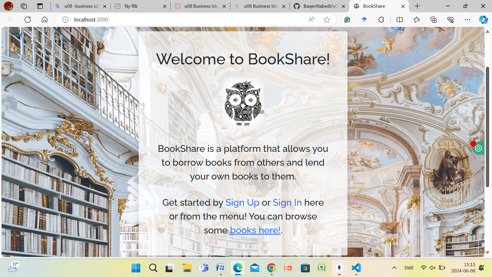
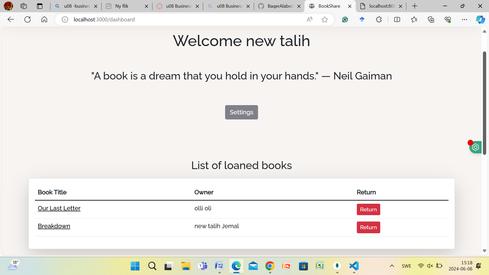
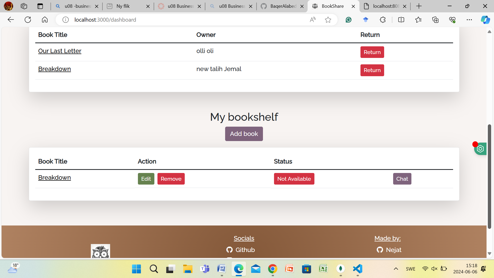
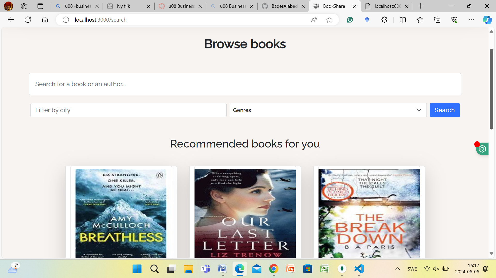
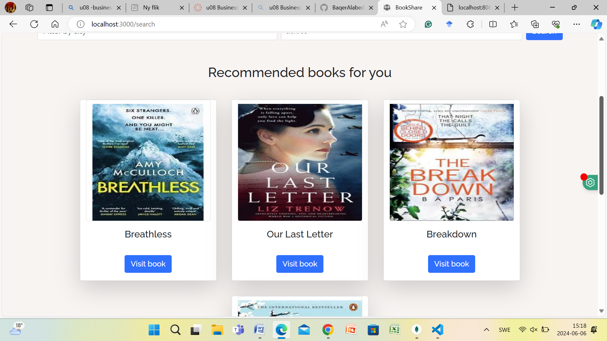
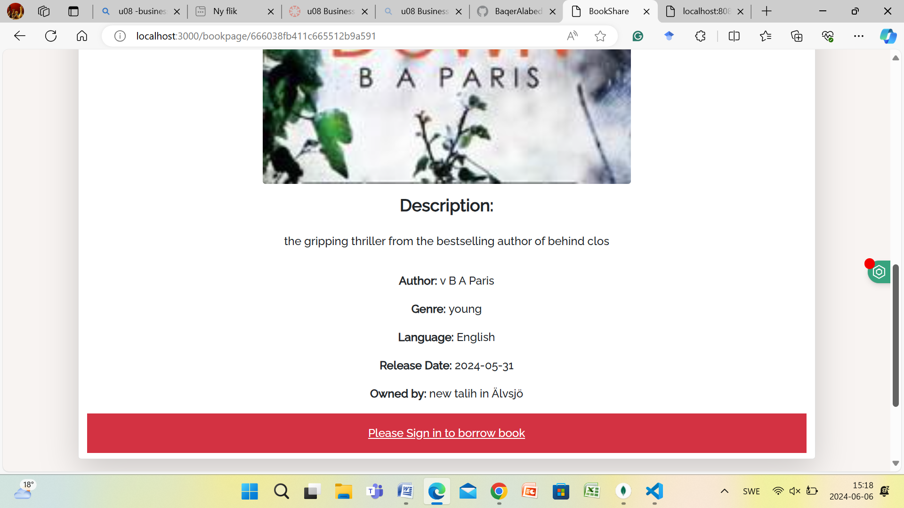
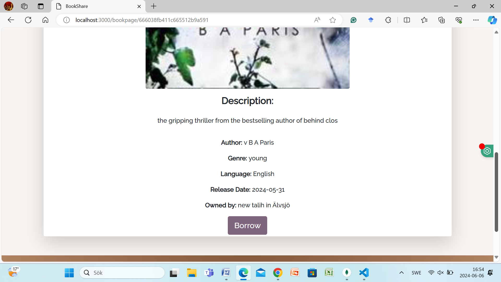
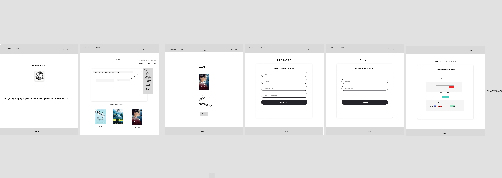

### BookShare Project Overview

This project was completed solely by me as part of my Fullstack Web Developer class at Chas Academy. The aim was to develop an app that allows users to find books to borrow and lend their own books to others.

#### Technologies Used
- **Frontend**: React
- **Backend**: Node.js/Express
- **Database**: MongoDB

Final result: [BookShare]()

### Installation

The tools used for this project include VSCode, Figma, Git, and GitHub. 

Follow these steps to set up the project:

1. **Clone the GitHub project**:
   ```sh
   git clone <https://github.com/chas-academy/u08-business-idea-bookshare.git>
   ```

2. **Start the Backend**:
### Node.js and MongoDB

The backend uses Express.js and MongoDB. To get started, navigate to the backend folder and install dependencies:
   ```sh
   cd backend
   npm install
   npm run start
   ```


3. **Start the Frontend**:
### React App

The frontend is built with React. Set up the frontend by navigating to the frontend folder and installing dependencies:

   ```sh
   cd ../frontend
   npm install
   npm run start
   ```

4. **Access the Application**:
   - Frontend: [localhost:3000](http://localhost:3000)
   - Backend: [localhost:8081](http://localhost:8081)


### Backend Routes

#### book.js
- **Create**: Add a new book to the database.
- **Get User Books**: Retrieve books belonging to the logged-in user.
- **Get Books**: Retrieve all books from the database.
- **Get Single Book**: Retrieve a book by its ID.
- **Update Book**: Update a book's information.
- **Delete Book**: Remove a book from the database.
- **Search Books**: Filter books based on search terms, city, and genre.


#### user.js
- **Authorization**: Authenticate a user.
- **Login**: Authenticate user credentials and set an access token.
- **Protected**: Access protected routes by validating the user token.
- **Register**: Register a new user.
- **Logout**: Remove the access token to log out the user.
- **Delete**: Delete a user by ID.
- **Edit**: Update user information by ID.
- **Reset Password**: Reset a user's password.
- **Get**: Retrieve a user's first name for display purposes.


### Frontend Components

#### addbook
- Form for users to add their own books to the database.

#### bookpage
- Displays book details dynamically based on the URL parameter.

#### dashboard
- Displays user information and books when a valid JWT token is present.

#### edit
- Allows users to update their personal information.

#### editbook
- Allows users to update their book information.

#### footer
- Contains copyright information and links to social media and GitHub accounts.

#### home
- Landing page with information about the app and links to register, login, and browse books.

#### login
- Authenticates user credentials and navigates to the dashboard on success.

.

#### registration
- Registers a new user by submitting form data to the backend.

#### search
- Searches for books by title or author, with additional filters for location and genre.

#### App.js
- Contains all routes to the components and the navbar.

### Future Features
- Connect the app to an external API to fetch more books.
- Add a queue function for users to wait for book availability.
- Implement rating and commenting for books and users.

### Answer to the Question: 

**What problem does this codebase solve?**

The BookShare project addresses the issue of accessibility and availability of books by providing a platform where users can borrow and lend books within their community. It creates a shared economy for books, making it easier for individuals to find books they want to read and lend out their own books to others. By facilitating this exchange, BookShare aims to reduce the cost and increase the variety of books available to users, fostering a community-driven approach to reading and book sharing.

### Example of Usage (Litet exempel på användning)

Here is a brief example of how to use the BookShare app:

1. **Home Page**
   - **Register** or **Login**: New users can register by filling out a simple form, and existing users can log in with their credentials.

   
   - **Browse Books**: Visitors can see a selection of available books and search for specific titles or authors.

   

2. **User Dashboard**
   - **User Information**: Once logged in, users can view the books they have listed.

  
  

  
   - **Add New Book**: Users can add new books to the database by filling out a form with details like title, author, genre, and location.

  
   

3. **Search for Books**
   - **Search Function**: Users can search for books by title or author and apply filters such as location and genre to narrow down results.





   - **View Book Details**: Click on a book to see more details, including availability and the owner's contact information.

   

4. **Book Details Page**
   - **Book Information**: Displays detailed information about the book, including title, author, genre, and availability status.

   

   - **Borrow Book**: Users can request to borrow the book from its owner.

    

   

### Future Features (Framtida Funktioner)
- **Connect to External API**: Fetch more books from external sources.
- **Queue Function**: Implement a system for users to queue for book availability.
- **Ratings and Comments**: Allow users to rate and comment on books and users.


### Figma lo-fi sketch for mobile and desktop





