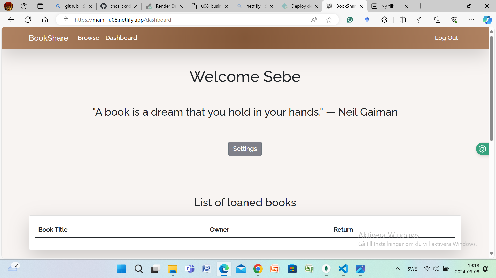

### BookShare Project Overview

This project was completed solely by me as part of my Fullstack Web Developer class at Chas Academy. The aim was to develop an app that allows users to find books to borrow and lend their own books to others.

#### Technologies Used
- **Frontend**: React
- **Backend**: Node.js/Express
- **Database**: MongoDB

Final result: [BookShare](https://main--u08.netlify.app/)

[BookShare-backend](https://u08-business-idea-bookshare.onrender.com/)

### Installation

The tools used for this project include VSCode, Figma, Git, and GitHub. 

Follow these steps to set up the project:

1. **Clone the GitHub project**:
   ```sh
   git clone <https://github.com/chas-academy/u08-business-idea-bookshare.git>
   ```

2. **Start the Backend**:
### Node.js and MongoDB

The backend uses Express.js and MongoDB. To get started, navigate to the backend folder and install dependencies:
   ```sh
   cd backend
   npm install
   npm run start
   ```


3. **Start the Frontend**:
### React App

The frontend is built with React. Set up the frontend by navigating to the frontend folder and installing dependencies:

   ```sh
   cd ../frontend
   npm install
   npm run start
   ```

4. **Access the Application**:
   - Frontend: [localhost:3000](http://localhost:3000)
   - Backend: [localhost:8081](http://localhost:8081)


### Backend Routes

#### book.js
- **Create**: Add a new book to the database.
- **Get User Books**: Retrieve books belonging to the logged-in user.
- **Get Books**: Retrieve all books from the database.
- **Get Single Book**: Retrieve a book by its ID.
- **Update Book**: Update a book's information.
- **Delete Book**: Remove a book from the database.
- **Search Books**: Filter books based on search terms, city, and genre.


#### user.js
- **Authorization**: Authenticate a user.
- **Login**: Authenticate user credentials and set an access token.
- **Protected**: Access protected routes by validating the user token.
- **Register**: Register a new user.
- **Logout**: Remove the access token to log out the user.
- **Delete**: Delete a user by ID.
- **Edit**: Update user information by ID.
- **Reset Password**: Reset a user's password.
- **Get**: Retrieve a user's first name for display purposes.


### Frontend Components

#### addbook
- Form for users to add their own books to the database.

#### bookpage
- Displays book details dynamically based on the URL parameter.

#### dashboard
- Displays user information and books when a valid JWT token is present.

#### edit
- Allows users to update their personal information.

#### editbook
- Allows users to update their book information.

#### footer
- Contains copyright information and links to social media and GitHub accounts.

#### home
- Landing page with information about the app and links to register, login, and browse books.

#### login
- Authenticates user credentials and navigates to the dashboard on success.

.

#### registration
- Registers a new user by submitting form data to the backend.

#### search
- Searches for books by title or author, with additional filters for location and genre.

#### App.js
- Contains all routes to the components and the navbar.


### Future Features (Framtida Funktioner)
- **Connect to External API**: Fetch more books from external sources.
- **Queue Function**: Implement a system for users to queue for book availability.
- **Ratings and Comments**: Allow users to rate and comment on books and users.


### Answer to the Question: 

**What problem does this codebase solve?**

The BookShare project addresses the issue of accessibility and availability of books by providing a platform where users can borrow and lend books within their community. It creates a shared economy for books, making it easier for individuals to find books they want to read and lend out their own books to others. By facilitating this exchange, BookShare aims to reduce the cost and increase the variety of books available to users, fostering a community-driven approach to reading and book sharing.

### Example of Usage (Litet exempel på användning)

Here is a brief example of how to use the BookShare app:

1. **Home Page**
   - **Register** or **Login**: New users can register by filling out a simple form, and existing users can log in with their credentials.

   
   - **Browse Books**: Visitors can see a selection of available books and search for specific titles or authors.

   

2. **User Dashboard**
   - **User Information**: Once logged in, users can view the books they have listed.

  
  

  
   - **Add New Book**: Users can add new books to the database by filling out a form with details like title, author, genre, and location.

  

   

   


**Edit Profile**: Users can update their profile, reset their password, or cancel their account by clicking the settings button.


**Book Editing**: Users have the ability to modify book details, delete entries, and check the availability status of the book.


   

3. **Search for Books**
   - **Search Function**: Users can search for books by title or author and apply filters such as location and genre to narrow down results.


   - **View Book Details**: Click on a book to see more details, including availability and the owner's contact information.

   

4. **Book Details Page**
   - **Book Information**: Displays detailed information about the book, including title, author, genre, and availability status.

   

   - **Borrow Book**: Users can request to borrow the book from its owner.

    

   


### Figma lo-fi sketch for mobile and desktop


### User Stories

#### 1. User Registration and Authentication
- **As a new user,** I want to register an account with my email and password, so I can access the app's features.
- **As a returning user,** I want to log in with my email and password, so I can access my account and manage my books.
- **As a user,** I want to log out, so I can ensure my account is secure when I'm not using the app.
- **As a user,** I want to reset my password if I forget it, so I can regain access to my account.

#### 2. Book Management
- **As a user,** I want to add a new book to the database by providing details like title, author, genre, and location, so others can borrow it.
- **As a user,** I want to edit the details of the books I have listed, so I can keep the information up to date.
- **As a user,** I want to delete a book from the database, so I can remove books that are no longer available for lending.
- **As a user,** I want to view a list of all books I have listed, so I can manage my lending library.

#### 3. Searching and Borrowing Books
- **As a visitor,** I want to search for books by title, author, genre, or location, so I can find books that interest me.
- **As a visitor,** I want to view the details of a specific book, so I can decide if I want to borrow it.
- **As a user,** I want to request to borrow a book, so I can arrange to pick it up from the owner.

#### 4. User Dashboard
- **As a user,** I want to view my profile information and the books I have listed, so I can see my activity on the app.
- **As a user,** I want to update my profile information, such as my name and email, so my contact details are current.

#### 5. Enhancing User Experience
- **As a user,** I want to browse a curated selection of books on the homepage, so I can discover new books to read.
- **As a user,** I want to rate and comment on books I have borrowed, so I can share my feedback with the community.
- **As a user,** I want to rate and comment on other users, so I can help build a trustworthy community.

#### 6. Future Features
- **As a user,** I want to connect to an external API to fetch more books, so I have a larger selection to choose from.
- **As a user,** I want to join a queue for book availability, so I can borrow popular books as soon as they are available.
- **As a user,** I want to receive notifications when a book I requested becomes available, so I can act promptly.

### Personas

#### Persona 1: Emily, the Avid Reader
- **Age:** 29
- **Occupation:** Marketing Manager
- **Background:** Emily loves reading and is always on the lookout for new books. She enjoys sharing her favorite books with friends and is excited about the idea of a community-driven book-sharing platform.
- **Goals:**
  - Find interesting books to read without spending too much money.
  - Share her personal book collection with others.
  - Discover new books through recommendations from the community.
- **Tech Comfort Level:** High
- **Frustrations:**
  - Spending a lot of money on new books.
  - Difficulty in finding books she is interested in locally.
  - Lack of a platform to share and discuss books with others.

#### Persona 2: John, the Casual Reader
- **Age:** 35
- **Occupation:** Software Engineer
- **Background:** John reads occasionally, mainly on weekends or during vacations. He prefers borrowing books rather than buying them and is interested in an easy way to find books.
- **Goals:**
  - Easily find and borrow books for leisure reading.
  - Avoid spending money on books he might only read once.
  - Utilize a simple, user-friendly platform.
- **Tech Comfort Level:** Medium
- **Frustrations:**
  - Limited selection at the local library.
  - Inconvenience of borrowing and returning physical books.
  - Unwillingness to buy books he may not finish.

#### Persona 3: Sarah, the Student
- **Age:** 21
- **Occupation:** University Student
- **Background:** Sarah is studying literature and frequently needs access to a variety of books for her coursework. She is tech-savvy and enjoys using online platforms for her academic needs.
- **Goals:**
  - Access a wide range of books for her studies.
  - Save money on books by borrowing instead of buying.
  - Connect with others who share her academic interests.
- **Tech Comfort Level:** High
- **Frustrations:**
  - High cost of academic books.
  - Difficulty in finding specific titles needed for her courses.
  - Limited access to books in the university library.

#### Persona 4: Michael, the Community Organizer
- **Age:** 45
- **Occupation:** Non-profit Manager
- **Background:** Michael runs a local community center and is always looking for ways to engage the community. He sees the BookShare app as a great tool to encourage reading and sharing within the community.
- **Goals:**
  - Promote reading and literacy in the community.
  - Facilitate easy access to books for everyone.
  - Organize community events around book sharing.
- **Tech Comfort Level:** Medium
- **Frustrations:**
  - Lack of resources for community programs.
  - Limited engagement in existing community activities.
  - Difficulty in managing physical donations of books.


